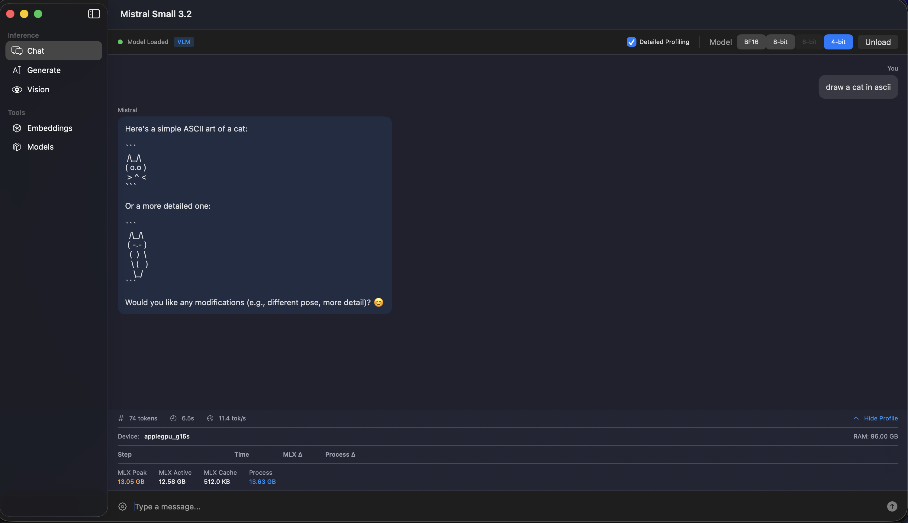
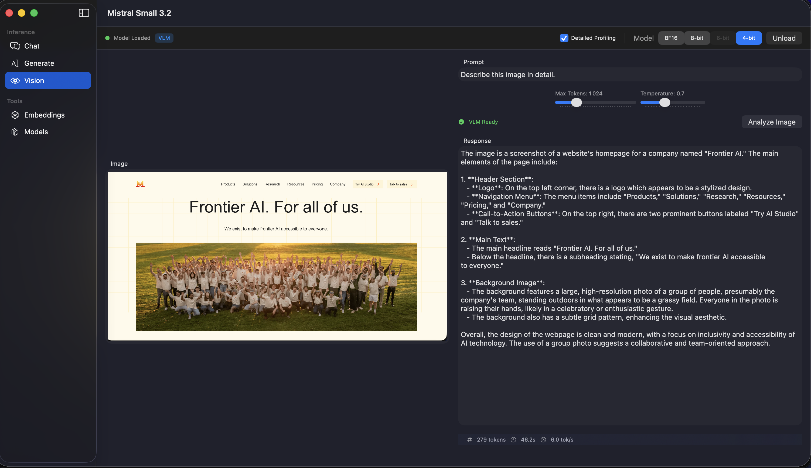
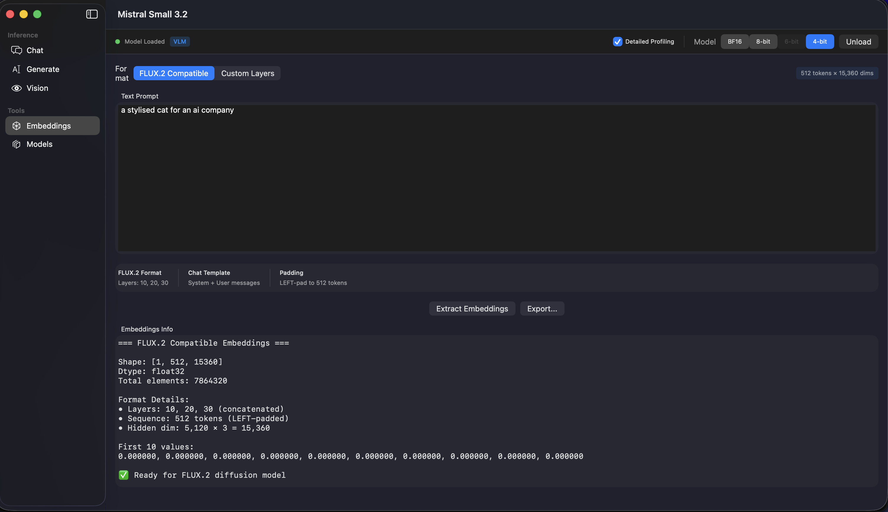
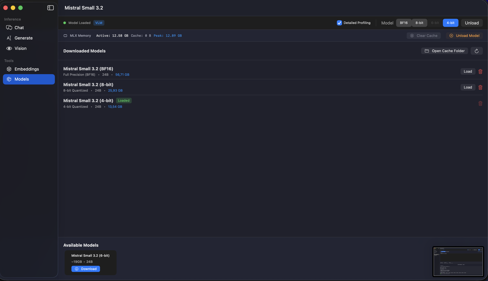

# FLUX.2 Text Encoders - Swift MLX

> [!IMPORTANT]
> ## This project has been merged into [flux-2-swift-mlx](https://github.com/VincentGourbin/flux-2-swift-mlx)
>
> This repository is now **archived**. All text encoder functionality has been integrated into the complete FLUX.2 inference pipeline:
>
> **[https://github.com/VincentGourbin/flux-2-swift-mlx](https://github.com/VincentGourbin/flux-2-swift-mlx)**
>
> The new repository provides:
> - Complete FLUX.2 image generation (not just text encoding)
> - Text encoders (Mistral, Qwen3) - from this project
> - VAE decoder
> - Transformer/DiT model
> - Full inference pipeline
>
> Please use the new repository for all future development.

---

Native Swift implementation of text encoders for FLUX.2 image generation on Apple Silicon using the MLX framework.
Supports both **Mistral Small 3.2** (for FLUX.2 dev) and **Qwen3** (for FLUX.2 Klein).

## Features

- **Mistral Small 3.2 (24B)** - Text encoder for FLUX.2 dev/pro
- **Qwen3 (4B/8B)** - Text encoder for FLUX.2 Klein
- **Text Generation** - Streaming text generation with configurable parameters
- **Interactive Chat** - Multi-turn conversation with chat template support
- **Vision Analysis** - Image understanding via Pixtral vision encoder (Mistral VLM)
- **FLUX.2 Embeddings** - Extract embeddings compatible with FLUX.2 image generation
- **Klein Embeddings** - Extract embeddings for FLUX.2 Klein (Qwen3-based)
- **Native macOS App** - Full-featured SwiftUI application
- **CLI Tool** - Complete command-line interface
- **Model Management** - Automatic download and caching from HuggingFace

## FLUX.2 Model Compatibility

| FLUX.2 Model | Text Encoder | Embedding Layers | Output Dimension |
|--------------|--------------|------------------|------------------|
| dev / pro | Mistral Small 3.2 | [10, 20, 30] | 15,360 |
| Klein 4B | Qwen3 4B | [9, 18, 27] | 7,680 |
| Klein 9B | Qwen3 8B | [9, 18, 27] | 12,288 |

## Requirements

- macOS 14.0+ (Sonoma or later)
- Apple Silicon (M1, M2, M3, M4)
- Xcode 15.0+ (for building)
- ~12GB RAM minimum (8-bit model)

## Dependencies

| Package | Version | Description |
|---------|---------|-------------|
| [mlx-swift](https://github.com/ml-explore/mlx-swift) | 0.30.2+ | MLX array framework for Apple Silicon |
| [swift-transformers](https://github.com/huggingface/swift-transformers) | 1.1.6+ | HuggingFace tokenizers and Hub API |
| [swift-argument-parser](https://github.com/apple/swift-argument-parser) | 1.2.0+ | Command-line argument parsing |

## Installation

### Swift Package Manager

Add to your `Package.swift`:

```swift
dependencies: [
    .package(url: "https://github.com/VincentGourbin/flux2-text-encoders-swift-mlx.git", from: "1.0.0")
]
```

### Build CLI

```bash
swift build -c release
```

### Build macOS App

```bash
swift build -c release --product FluxEncodersApp
```

## Usage

### Library API

```swift
import FluxTextEncoders

// === Mistral (FLUX.2 dev) ===

// Load Mistral model
try await FluxTextEncoders.shared.loadModel(variant: .mlx8bit)

// Generate text
let result = try FluxTextEncoders.shared.generate(prompt: "Hello") { token in
    print(token, terminator: "")
    return true
}

// Chat
let messages = [["role": "user", "content": "Hello!"]]
let response = try FluxTextEncoders.shared.chat(messages: messages)

// FLUX.2 dev Embeddings
let embeddings = try FluxTextEncoders.shared.extractFluxEmbeddings(prompt: "A cat")
// Shape: [1, 512, 15360]

// Vision (VLM)
try await FluxTextEncoders.shared.loadVLMModel(variant: .mlx4bit)
let analysis = try FluxTextEncoders.shared.analyzeImage(path: "photo.jpg", prompt: "Describe this")

// === Qwen3 (FLUX.2 Klein) ===

// Load Qwen3 model
try await FluxTextEncoders.shared.loadQwen3Model(variant: .qwen3_4B_8bit)

// Chat with Qwen3
let qwenResult = try FluxTextEncoders.shared.chatQwen3(
    messages: [["role": "user", "content": "Hello!"]],
    parameters: GenerateParameters(maxTokens: 500)
)

// FLUX.2 Klein Embeddings
let kleinEmbeddings = try FluxTextEncoders.shared.extractKleinEmbeddings(
    prompt: "A sunset over mountains",
    config: .klein4B
)
// Shape: [1, 512, 7680] for Klein 4B
```

### CLI Commands

```bash
# Chat mode (default - Mistral)
flux-encoders chat

# Chat with Qwen3
flux-encoders chat --qwen3

# Text generation
flux-encoders generate "Your prompt here" --temperature 0.7

# Vision analysis (Mistral VLM)
flux-encoders vision image.jpg "What's in this image?"

# Extract FLUX.2 dev embeddings (Mistral)
flux-encoders embed "Your text" --flux --output embeddings.bin

# Extract FLUX.2 Klein embeddings (Qwen3)
flux-encoders embed "Your text" --klein 4b --output klein_embeddings.bin

# Upsampling (enhance prompts using Qwen3)
flux-encoders upsample "A cat" --style photographic

# Manage models
flux-encoders models
flux-encoders models --download mistral-8bit
flux-encoders models --download qwen3-4b-8bit
```

## Model Variants

### Mistral Small 3.2 (FLUX.2 dev)

| Variant | Size | RAM Required | Speed |
|---------|------|--------------|-------|
| BF16 | ~48GB | 64GB+ | Baseline |
| 8-bit | ~24GB | 32GB | ~Same |
| 4-bit | ~12GB | 16GB | Slightly slower |

### Qwen3 (FLUX.2 Klein)

| Model | Variant | Size | RAM Required |
|-------|---------|------|--------------|
| Qwen3 4B | 8-bit | ~4GB | 8GB |
| Qwen3 4B | 4-bit | ~2GB | 6GB |
| Qwen3 8B | 8-bit | ~8GB | 12GB |
| Qwen3 8B | 4-bit | ~4GB | 8GB |

## Screenshots

### Chat Interface


### Vision Analysis (VLM)


### FLUX.2 Embeddings


### Model Management


## Benchmarks

Performance comparison between Swift MLX and Python MLX on Apple Silicon (M-series).

### Text Generation (tokens/s)

| Quantization | Swift MLX | Python MLX | Swift Advantage |
|--------------|-----------|------------|-----------------|
| 4-bit | **11.8** | 6.4 | 1.84x faster |
| 6-bit | **9.3** | 5.3 | 1.75x faster |
| 8-bit | **8.0** | 4.2 | 1.90x faster |

**Swift MLX is ~1.8x faster for text generation across all quantizations.**

### Vision (VLM)

| Quantization | Swift MLX | Notes |
|--------------|-----------|-------|
| 4-bit | 2.5 tok/s | Correct output |
| 6-bit | 2.2 tok/s | Correct output |
| 8-bit | 2.1 tok/s | Correct output |

**Note:** Python `mlx_vlm` produces incorrect/hallucinated responses for this model (describes wrong images, shows raw BPE tokens). Swift VLM is the **only working implementation**.

### Summary

| Use Case | Recommendation |
|----------|----------------|
| Text Generation | **Swift MLX** (1.8x faster) |
| Vision/VLM | **Swift MLX** (only working implementation) |
| Embeddings | Either (similar performance) |

See [Scripts/Benchmark/results/COMPARISON_REPORT.md](Scripts/Benchmark/results/COMPARISON_REPORT.md) for detailed benchmark methodology and results.

## Architecture

```
Sources/
├── FluxTextEncoders/    # Core library
│   ├── Model/           # Mistral transformer
│   │   └── Qwen3/       # Qwen3 transformer
│   ├── Vision/          # Pixtral vision encoder
│   ├── Tokenizer/       # Tekken tokenizer
│   ├── Embeddings/      # FLUX.2 & Klein extraction
│   └── Generation/      # Text generation (Mistral & Qwen3)
├── FluxEncodersCLI/     # Command-line tool
└── FluxEncodersApp/     # SwiftUI macOS app
```

## API Documentation

See [Documentation/API.md](Documentation/API.md) for complete API reference.

## Changelog

### v1.1.0 (January 2025)
- **Upgraded to mlx-swift 0.30.2** - Latest MLX framework with improved performance
- **Upgraded to swift-transformers 1.1.6** - Latest HuggingFace tokenizers with Swift 6 support
- **Fixed RoPE bug** - Resolved text generation issues with KV cache (repetition/corruption)
- **Memory API updates** - Internal migration from `GPU.*` to `Memory.*` namespace

### v1.0.0 (January 2025)
- Initial release with Mistral Small 3.2 and Qwen3 support
- FLUX.2 dev/pro and Klein embeddings extraction
- Vision analysis with Pixtral encoder
- Native macOS SwiftUI application

## License

MIT License - see [LICENSE](LICENSE) file
